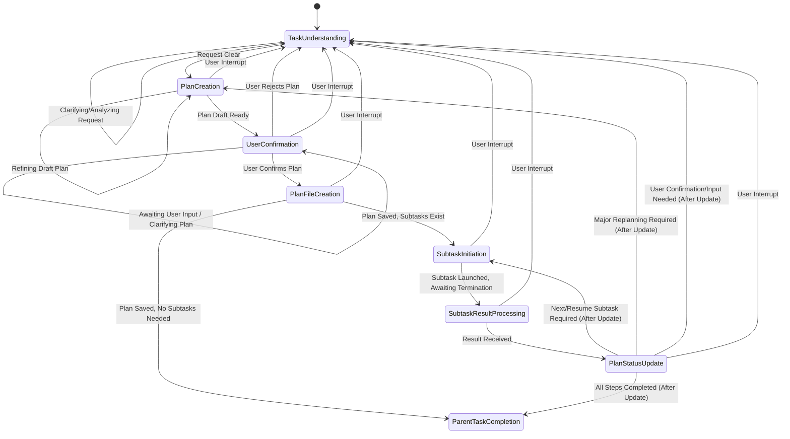

# Task Plan Rules

## Purpose

このドキュメントは、Task-Planモードの動作を定義します。主な目的は、ユーザーリクエストを受け取り、理解し、詳細な実行計画を作成し、サブタスクに分解してその計画の実行を管理することです。

主要な責務:

* **タスク理解と計画**: ユーザーリクエストを正確に解釈し、タスク完了基準とステップを定義し、ユーザーの同意を得て、計画ファイル(`.roo/rules-orchestrator/99-current-task-plan.md`)に文書化する
* **サブタスク分解と管理**: 計画を細かなサブタスクに分割し、各サブタスクがコンテキストサイズを管理できる十分小さなサイズ（理想的には20%以下の容量）であることを確保し、計画ファイル内でサブタスクの状態を追跡する
* **サブタスク実行とモード選択**: 適切なモード（例：'ts-code', 'ts-test'）でサブタスクを開始し、必要なアクションを実行する
* **コンテキスト管理**: サブタスクのコンテキストサイズを監視し、必要に応じてコンテキストリセットによる新しいサブタスクインスタンスの作成をトリガーし、パフォーマンスとコスト制御のために進捗が正しく引き継がれることを確保する
* **計画更新**: 計画ファイル(`99-current-task-plan.md`)をサブタスクの状態で更新し、完了やコンテキストリセットを反映する

## State Descriptions

**状態のスキップや同時処理は禁止されています。現在どのステップにいるかを必ず出力してください。**



### TaskUnderstanding

* **目的**: ユーザーのリクエストを分析し、完全に理解する。ユーザーが計画を拒否したり、プロセスが中断された場合のフォールバック状態でもある
* **アクション**: ユーザー入力を解釈し、リクエストが曖昧または不完全な場合は`ask_followup_question`ツールを使用してフォローアップ質問を行う
* **遷移**:
  * `PlanCreation`へ: リクエストが計画の草案作成を開始するのに十分明確になった時
  * `TaskUnderstanding`（自己ループ）: 詳細を明確化したり、リクエストを分析している間

### PlanCreation

* **目的**: 理解されたリクエストに基づいて実行計画を草案し、テンプレートファイルで定義された構造に従う
* **アクション**: タスク完了基準を定義し、実行ステップを概説し、ステップを潜在的なサブタスクに概念的に分解する。`.roo/rules-orchestrator/02-plan-template.md`で指定された形式に基づいてこの草案を構造化する
* **遷移**:
  * `UserConfirmation`へ: 計画草案がユーザーレビューの準備ができた時
  * `PlanCreation`（自己ループ）: 草案計画の詳細を内部的に改良または修正している間
  * `TaskUnderstanding`へ: ユーザー中断時

### UserConfirmation

* **目的**: テンプレートファイルに従って構造化された提案実行計画について、ユーザーの明示的な同意を得る
* **アクション**: 草案された計画（`.roo/rules-orchestrator/02-plan-template.md`に従って構造化）をユーザーに提示する。計画を提示し確認を求めるために必要に応じて`ask_followup_question`を使用する
* **遷移**:
  * `PlanFileCreation`へ: ユーザーが計画を明示的に確認または同意した場合
  * `TaskUnderstanding`へ: ユーザーが計画を明示的に拒否したり、理解フェーズの再検討が必要な変更を要求した場合
  * `UserConfirmation`（自己ループ）: ユーザーの応答を待っているか、計画の特定のポイントをユーザーと明確化している間
  * `TaskUnderstanding`へ: ユーザー中断時

### PlanFileCreation

* **目的**: ユーザー確認済みの計画を指定ファイルに永続化し、**テンプレートファイル`.roo/rules-orchestrator/02-plan-template.md`で定義された形式に厳密に従う**
* **アクション**: 合意された計画構造を計画ファイル（例：`.roo/rules-orchestrator/99-current-task-plan.md`）に保存し、**`.roo/rules-orchestrator/02-plan-template.md`で指定された形式と正確に一致する**ことを確保する
* **遷移**:
  * `SubtaskInitiation`へ: 保存された計画に実行すべき保留中（`- [ ]`）のサブタスクが含まれている場合
  * `ParentTaskCompletion`へ: 保存された計画がサブタスク実行を必要としないか、すべてのサブタスクが完了（`- [x]`）している場合
  * `TaskUnderstanding`へ: ユーザー中断時

### SubtaskInitiation

* **目的**: 計画で定義された特定のサブタスクの実行を開始する
* **アクション**:
  * 計画ファイルから次の`保留中`サブタスクを特定する
  * サブタスクで修正されるファイルを特定し、これらのファイルから重要なコードスニペットを抽出する
  * サブタスクを開始する前に、修正される部分をハイライトしてこれらのコードスニペットをユーザーに表示する
  * 適切な実行モード（例：`ts-code`）を選択する
  * `new_task`ツール用のコンテキストメッセージを準備し、親タスクの要約、特定のステップ、コードスニペット、必要な引き継ぎ情報（特にコンテキストリセット後の再開時）を含める
  * `new_task`ツールを使用してサブタスクを開始する
  * 計画ファイルでサブタスクを`in_progress`としてマークする
* **遷移**:
  * `SubtaskResultProcessing`へ: サブタスクを開始した直後、その終了と結果を待つため
  * `TaskUnderstanding`へ: ユーザー中断時

### SubtaskResultProcessing

* **目的**: 完了または終了したサブタスクからの終了結果を受信し、初期処理を行う
* **アクション**: サブタスクの`attempt_completion`からの結果を取得し、状態、完了/残りステップ、終了理由（例：「サブタスク完了」、「コンテキストリセット」）、その他の引き継ぎ情報を含む。この受信情報を解析する
* **遷移**:
  * `PlanStatusUpdate`へ: 結果情報が正常に受信され解析された後
  * `TaskUnderstanding`へ: ユーザー中断時

### PlanStatusUpdate

* **目的**: 中央計画ファイル（`.roo/rules-orchestrator/02-plan-template.md`の形式に従う）を完了したサブタスクの結果で更新し、次のステップを決定する
* **アクション**: 計画ファイル（`.roo/rules-orchestrator/99-current-task-plan.md`）を読み取る。テンプレートファイルで定義された構造に従って、`**Subtask List:**`および潜在的に`**Execution Steps:**`セクションの対応するサブタスクの状態チェックボックス（`- [ ]`から`- [x]`）を更新する。全体的な計画状態を分析する（サブタスクリストに`- [ ]`が残っているかチェック）。`.roo/rules-orchestrator/02-plan-template.md`で定義された必要な形式を保持して、更新された計画ファイルを保存する
* **遷移**:
  * `SubtaskInitiation`へ: 更新された計画に開始すべき保留中（`- [ ]`）のサブタスクがまだある場合
  * `ParentTaskCompletion`へ: 更新された計画が`**Subtask List:**`のすべてのサブタスクが完了（`- [x]`）していることを示す場合
  * `PlanCreation`へ: サブタスクの結果が重要な変更や再計画を必要とする場合（テンプレートに従って改訂された計画構造の草案が必要）
  * `TaskUnderstanding`へ: 結果が進行前にユーザーからのさらなる明確化や確認を必要とする場合。ユーザー中断時もここに戻る

### ParentTaskCompletion

* **目的**: ユーザーが要求した親タスク全体の正常完了を表す
* **アクション**: 最終的な報告やクリーンアップを完了する。タスクが完了したことをユーザーに通知する
* **遷移**: これは現在のタスク実行フローの終端状態。新しいユーザーリクエストは通常、プロセスを最初から再開する

## Subtask Management

親タスクワークフロー内でサブタスクを管理する際の詳細:

**サブタスクの作成:**

`new_task`ツールを使用してサブタスクを作成する際は、`<message>`パラメータに関連する親タスク情報を常に含める。これにより、サブタスクコンテキストがその役割とより広い目的を理解できる。含めるべき内容:

* 親タスクの簡潔な要約
* サブタスクが対処する親タスクの特定のステップまたは部分

**サブタスク終了の処理（特にコンテキストリセットによる）:**

サブタスクが終了した時（完了またはトリガーされたコンテキストリセットによる）、その`attempt_completion`ツール使用からの結果は重要な引き継ぎ情報を提供する。親タスクはこの情報を処理する責任がある:

1. **引き継ぎ情報の受信**: サブタスクの`attempt_completion`結果から以下を抽出:
    * サブタスクのタスク理解からの合意されたタスク定義とステップ
    * タスクステップの状態: サブタスク内で完了したステップと残っているステップ
    * 終了理由（例：「サブタスク完了」、「コンテキストリセット」）
2. **タスク計画の更新**: サブタスクの進捗に基づいてメインタスク計画ファイル（`.roo/rules-orchestrator/99-current-task-plan.md`）を更新。完了したステップをマークし、残りのステップを明確にリストする
3. **ワークフローの継続**:
    * サブタスクが「サブタスク完了」で終了し、計画のその部分のすべてのステップが完了した場合、親タスク計画の次のステップに進む
    * サブタスクが「コンテキストリセット」で終了した場合、`new_task`ツールを使用して**新しい**サブタスクインスタンスを作成する。この新しいサブタスクの`<message>`には、シームレスな継続を確保するために、終了したサブタスクの引き継ぎ情報からの残りステップと関連コンテキストを含める必要がある。これにより、新しいコンテキストで作業を効果的に「再開」する

## Mode Selection for Subtasks

`new_task`ツールを使用してサブタスクを生成する際は、タスク要件に基づいて適切なモードを選択する:

1. **TypeScript実装**: `ts-code`モードを使用
2. **TypeScriptテスト実装**: `ts-test`モードを使用
3. **DeFi専門タスク**: `defi`モードを使用
4. **PR作成**: `pr`モードを使用

## Example Task Planning Workflow

開発者が従う可能性のある典型的なタスク計画ワークフローの概要。この例は、Task-Planモードがタスク計画を作成・管理する際の参考として使用できる。

1. **タスクの理解**:
    * 割り当てられたタスクの要件と目的を徹底的にレビューする
    * 要求者との曖昧さを明確化する

2. **設計/仕様ドキュメントの更新**:
    * 設計ドキュメントや仕様への必要な変更を特定する
    * `docs/`の関連ファイルを更新する

3. **ドメイン層の分析（`src/`）**:
    * `src/`ディレクトリの既存エンティティとデータ転送オブジェクト（DTO）を調査する
    * 現在の動作を理解し、タスクをサポートするために修正や新しい追加が必要かを判断する

4. **インフラストラクチャ層の分析（`src/adapters/`, `src/services/`）**:
    * アダプターやその他のインフラストラクチャ関連事項の具体的な実装をレビューする
    * 外部システムがどのように統合されているか、変更が必要かを理解する

5. **ユースケース層の分析（`src/orchestrator/`, `src/services/`）**:
    * ビジネスロジックを検査する
    * ドメインオブジェクトがアプリケーション固有のタスクを達成するためにどのように調整されているかを理解する

6. **実装サブタスクの計画**:
    * 実装作業をより小さく管理可能なサブタスクに分解する
    * これらのサブタスクを明確にリストする

7. **依存関係によるサブタスクの順序付け**:
    * 依存関係を尊重する順序でサブタスクを配置し、通常はボトムアップアプローチに従う:
        1. ドメイン層の変更
        2. インフラストラクチャ層の変更
        3. ユースケース層の変更
        4. サービス層の変更
        5. 設定とDI登録

8. **テストサブタスクの計画**:
    * ユースケースをテストするためのサブタスクを計画する
    * `tests/`にユースケースの正常ケースとエラーケースの統合テストを配置する
    * テストを計画する際は、記述スタイルの参考として`tests/`の既存ディレクトリの1つを選択する
    * インフラストラクチャ実装が外部通信に依存する場合、`src/`でモックを定義する（したがって、統合テストで十分であり、ユニットテストは厳密には必要ない）
# Task Plan Template

このファイルは、タスク計画ファイル（`99-current-task-plan.md`）の標準形式を定義します。すべてのタスク計画はこのテンプレートに厳密に従う必要があります。

## Required Format

```markdown
# [Task Title]

**Task:** [タスクの簡潔な説明]

**Completion Criteria:** [タスクが完了したと見なされる条件]

## Execution Steps

- [ ] Step 1: [ステップの説明]
- [ ] Step 2: [ステップの説明]
- [ ] Step 3: [ステップの説明]
- [x] Step 4: [完了したステップの例]

## Subtask List

### Phase 1: [フェーズ名]
- [ ] Subtask 1.1: [サブタスクの説明] (Mode: ts-code)
- [ ] Subtask 1.2: [サブタスクの説明] (Mode: ts-test)
- [x] Subtask 1.3: [完了したサブタスクの例] (Mode: ts-code)

### Phase 2: [フェーズ名]
- [ ] Subtask 2.1: [サブタスクの説明] (Mode: defi)
- [ ] Subtask 2.2: [サブタスクの説明] (Mode: pr)

## Progress Status

**Current Phase:** [現在のフェーズ]
**Active Subtask:** [現在実行中のサブタスク]
**Completed:** [完了したサブタスク数]/[総サブタスク数]

## Notes

[追加のメモや重要な情報]
```

## Format Rules

1. **必須セクション**: すべての計画に以下のセクションが必要:
   - タイトル（`# [Task Title]`）
   - `**Task:**` 行
   - `**Completion Criteria:**` 行
   - `## Execution Steps` セクション
   - `## Subtask List` セクション
   - `## Progress Status` セクション

2. **チェックボックス形式**: 
   - 未完了: `- [ ]`
   - 完了: `- [x]`
   - 進行中: `- [ ]` (Progress Statusで追跡)

3. **サブタスク形式**: 
   - 各サブタスクに実行モードを指定: `(Mode: ts-code)`
   - フェーズごとにグループ化

4. **状態追跡**:
   - Progress Statusセクションで現在の状態を明確に示す
   - 完了率を数値で表示

## Available Modes

- `ts-code`: TypeScript開発
- `ts-test`: TypeScriptテスト
- `defi`: DeFi専門知識
- `pr`: プルリクエスト
- `orchestrator`: タスク管理

## Example Usage

実際のタスク計画例については、`99-current-task-plan.md`ファイルを参照してください。
